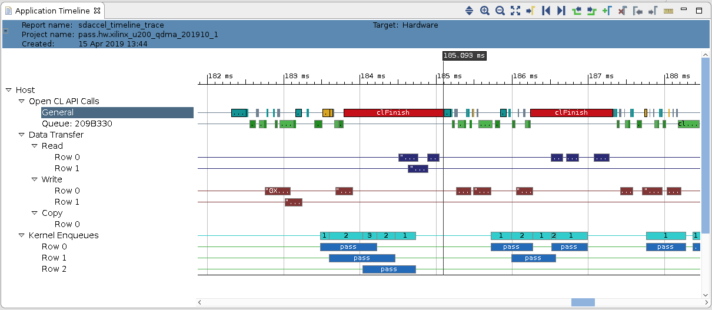

<p align="right">
<a href="../../../docs/host-code-opt/README.md">English</a> | <a>日本語</a>
</p>
<table>
 <tr>
   <td align="center"><h1>2019.1 SDAccel™ 開発環境チュートリアル</h1>
   <a href="https://github.com/Xilinx/SDAccel-Tutorials/branches/all">その他のバージョンを表示</a>
   </td>
 </tr>
 <tr>
 <td align="center"><h1>ホスト コードの最適化</h1>
 </td>
 </tr>
</table>

# 概要

このチュートリアルでは、FPGA アクセラレーション アプリケーションに関連するホスト コードのパフォーマンスを調整する方法について説明します。ホスト コード最適化は、パフォーマンス最適化の 1 つにすぎません。ホスト コード最適化には、次のような最適化が含まれます。

* ホスト プログラム最適化
* カーネル コード最適化
* トポロジ最適化
* インプリメンテーション最適化

# チュートリアルの概要

このチュートリアルでは、1 つの単純な C++ カーネル インプリメンテーションを使用することで、カーネル コードの修正や、トポロジ最適化、およびホスト コード インプリメンテーションの解析に基づいたインプリメンテーション選択などをしなくてすむようにしています。

> **注記:** このチュートリアルのホスト コード最適化手法では、アクセラレータのインテグレーションを最適化する点についてのみ説明します。複数の CPU コアを使用したり、ホスト コードのメモリを管理したりといったその他のよく使用される手法は、ここには含めません。詳細は、『SDAccel プロファイリングおよび最適化ガイド』 ([UG1207](https://japan.xilinx.com/html_docs/xilinx2019_1/sdaccel_doc/zgr1534452172723.html)) を参照してください。

次のセクションでは、次の特定のホスト コード最適化に関する注意点について説明します。

* ソフトウェア パイプライン/イベント キュー
* カーネルおよびホスト コードを同期
* バッファー サイズ

# 開始前の注意点

このチュートリアルでは、次を使用します。

* BASH Linux シェル コマンド
* 2019.1 SDx リリースおよび xilinx\_u200\_xdma\_201830\_1 プラットフォーム。  
必要であれば、その他のバージョンおよびプラットフォームも使用できます。

> **重要:**
>
> * サンプル ファイルを実行する前に、『SDAccel 開発環境リリース ノート、インストール、およびライセンス ガイド』 ([UG1238)](https://japan.xilinx.com/html_docs/xilinx2019_1/sdaccel_doc/yrc1534452173645.html)) で説明されるように、ザイリンクス ランタイム (XRT) と SDAccel 開発環境ツールをインストールしてください。
> * Alveo™ カードでアプリケーションを実行する場合は、『Alveo データセンター アクセラレータ カード入門ガイド ([UG1301](https://japan.xilinx.com/support/documentation/boards_and_kits/accelerator-cards/ug1301-getting-started-guide-alveo-accelerator-cards.pdf)) で説明されるように、カードとソフトウェア ドライバーを正しくインストールしてください。

## チュートリアル リファレンス ファイルの入手

1. リファレンス ファイルを入手するには、ターミナルに `git clone https://github.com/Xilinx/SDAccel-Tutorials` と入力します。
2. `SDAccel-Tutorials-master/docs/host-code-opt/reference-files` に移動します。

# モデル

この例では、カーネルはホスト コード最適化目的にのみ作成されます。チュートリアル全体でスタティックになるように設計されるので、ホスト コードの最適化の影響がわかるようになっています。

<!--this could be better suited as a table-->
C++ カーネルには、入力ポートと出力ポートが 1 つずつあります。これらのポートの幅は、AXI 帯域幅を最適に使用するため、512 ビットになっています。実行ごとにカーネルで消費されるエレメント数は、`numInputs` パラメーターで設定できます。同様に、`processDelay` パラメーターを使用すると、カーネルのレイテンシを変更できます。このアルゴリズムは、`ProcessDelay` の値分、入力値を増加しますが、これは `processDelay` 回分入力値を各回で 1 ずつ増加するループによりインプリメントされます。このループはカーネル インプリメンテーション内にあるので、反復ごとに一定量のサイクルが必要とされるようになり `processDelay` 数で乗算されます。

カーネルは、AXI バースト転送をイネーブルにするようにも設計されています。カーネルには、読み出しおよび書き込みプロセスが含まれ、プロセスの終わり頃に実際のカーネル アルゴリズム (`exec`) と並列で実行されます。読み出しおよび書き込みプロセスは AXI トランザクションを単純なループで開始し、受け取った値を内部 FIFO に書き込むか、内部 FIFO から読み出して AXI 出力に書き込みます。SDAccel コンパイラは、これらのブロックを同時処理の並列プロセスとしてインプリメントします。これは、DATAFLOW プラグマが周囲の `pass_dataflow` 関数で設定されているためです。

# カーネルのビルド

> **注記:** このチュートリアルでは、すべての手順を `reference-files` ディレクトリから実行します。

ホスト コードの中にはハードウェア エミュレーションを使用して実行しても問題ないものもありますが、正確なランタイム情報および大型のテスト ベクターの実行には、実際のアクセラレータ カード ハードウェア上でカーネルを実行する必要があります。通常、カーネルはホスト コード最適化中には変更されないものなので、カーネルをハードウェアに対してコンパイルする必要があるのは 1 回だけです。

次の makefile コマンドを実行して、カーネルを特定のアクセラレータ カードにコンパイルします。

```
make TARGET=hw DEVICE=xilinx_u200_xdma_201830_1 kernel
```

> **注記:** このビルド プロセスには数時間かかるので、カーネル コンパイルはホスト コードのパフォーマンスの影響を解析する前に終了しておく必要があります。

# ホスト コード

ホスト コードのさまざまなインプリメンテーション オプションを検証する前に、コードの構造を確認します。ホスト コード ファイルは、ホスト コード最適化の重要な点に集中できるように設計されています。

共通ソース ディレクトリ (`srcCommon`) のヘッダー ファイルには、次の 3 つのクラスが含まれます。

* `srcCommon/AlignedAllocator.h`: `AlignedAllocator` は 2 つのメソッドを含む小型の構造体です。この構造体は、テスト ベクターのメモリ アライメントされた割り当てをサポートするヘルパー クラスとして提供されています。メモリ アライメントされたブロックのデータの方が速く転送でき、データ送信がメモリ アライメントされない場合は OpenCL™ API ライブラリで警告が作成されます。

* `srcCommon/ApiHandle.h`: 次の主な OpenCL API オブジェクトをカプセル化します。

  * context
  * program
  * `device_id`
  * execution kernel
  * `command_queue`

  これらの構造はコンストラクターで作成され、デフォルトの OpenCL API 関数呼び出しのシーケンスを 1 つずつ実行します。コンストラクターには、次の 2 つの設定パラメーターのみがあります。

  * FPGA をプログラムするのに使用するビットストリーム (xclbin) の名前を含む文字列。
  * 順不同キューを作成するか、順番通りの実行キューを作成する必要があるかどうかを決定するブール。

  このクラスには、バッファーの生成およびアクセラレータでのタスクのスケジューリングに必要なキュー、コンテキスト、カーネルへの補足的な関数が含まれます。また、`ApiHandle` デストラクターが呼び出されると、自動的に割り当てられた OpenCL API オブジェクトが解放されます。

* `srcCommon/Task.h`: オブジェクト クラス `Task` は、アクセラレータで実行されるワークロードの 1 つのインスタンスを示します。このクラスのオブジェクトがコンストラクトされると、バッファー サイズに基づいて入力および出力ベクターが割り当てられて初期化され、タスク呼び出しごとに転送されるようになります。同様に、デストラクターはタスク実行中に生成されたオブジェクトの割り当てを解除します。

  > **注記:** このように 1 つのモジュールの呼び出しのために 1 つのワークロードがカプセル化される場合、このクラスに出力検証関数 (`outputOk`) も含めることができます。

  このクラスのコンストラクターには、次の 2 つのパラメーターが含まれます。

  * `bufferSize`: このタスクが実行される際に転送される 512 ビット値の数を指定します。
  * `processDelay`: 同様の名前のカーネル パラメーターを提供します。検証中にも使用されます。

  このクラスで最も重要なメンバー関数は、`run` です。この関数は、アルゴリズムを実行するため、次の 3 つの異なる手順を使用してエンキューします。

  1. FPGA アクセラレータへデータを書き込む
  2. カーネルを設定して、アクセラレータを実行
  3. FPGA アクセラレータからデータを読み戻す

  これらを実行するため、通信用にバッファーが DDR で割り当てられます。また、異なるコマンド間の依存性 (実行前読み出し前に書き込み) を作成するために、イベントが使用されます。

  `run` 関数には、ApiHandle オブジェクトだけでなく、1 つの条件引数があります。この引数を使用すると、タスクを前に生成したイベントに依存するようにでき、このチュートリアルの後半で説明するように、ホスト コードでタスク順の依存性を構築できるようになります。

  これらのヘッダー ファイルのコードはいずれもこのチュートリアル中には変更されません。主な概念はすべて次に含まれる異なる `host.cpp` ファイルに表示されます。

  * `srcBuf`
  * `srcPipeline`
  * `srcSync`

  ただし、次のセクションで説明するように、`host.cpp` ファイルの main 関数でさえも特別な構造に従っています。

## host.cpp の main 関数

main 関数には、次のセクションが含まれます。

1. **Environment / Usage Check**
2. **Common Parameters**:
   * `numBuffers`: 変更されないパラメーターです。カーネル実行の回数を指定するために使用します。
   * `oooQueue`: true の場合、このブール値で ApiHandle 内で生成される OpenCL イベント キューの種類を宣言します。
   * `processDelay`: カーネルで必要とされる計算時間を人工的に遅らせます。このパラメーターは、このバージョンのチュートリアルでは使用しません。
   * `bufferSize`: カーネル実行ごとに転送される 512 ビット値の数を宣言します。
   * `softwarePipelineInterval`: 同期の発生前に前もってスケジュールできる演算の数を指定します。
3. **Setup**: 設定変数のステータスを知らせるため、このセクションには最終的な設定を表示します。
4. **Execution**: このセクションでは、複数の異なるホスト コードのパフォーマンス問題をモデル化できます。このチュートリアルでは、これらの行について説明します。
5. **Testing**: 実行が終了したら、出力で単純なチェックを実行します。
6. **Performance Statistics**: モデルが実際のアクセラレータ カードで実行されると (エミュレーションなし)、ホスト コードがシステム時間の計測に基づいてパフォーマンス統計を計算して表示します。

> **注記:** setup セクションだけでなくその他のセクションも、システム ステータスに関連する追加メッセージのほか、run の全体的な `PASS` または `FAIL` も表示できます。

## 順不同のイベント キューを使用してパイプライン処理済みのカーネルを実行

ここでは、パイプライン処理されたカーネル実行を確認します。

> **注記:** 1 つの計算ユニット (CU) (カーネルのインスタンス) を扱っているので、結果的にハードウェアで実際に実行できるカーネルは 1 つだけです。前述のように、カーネルの実行には、データが CU から送受信される必要もあります。これらの動作はパイプライン処理して、ホスト アプリケーションで動作するカーネルのアイドリング時間を最小限に抑える必要があります。

1. 次のコードを使用して、ホスト コード (`srcPipeline/host.cpp`) をコンパイルして実行するところから始めます。

   ```
   make TARGET=hw DEVICE=xilinx_u200_xdma_201830_1 pipeline
   ```

   カーネルのコンパイル時間と比べると、ビルド段階の方がかなり速く実行されます。

   ホスト コードの 55 行目から開始される実行ループを確認してください。

   ```cpp
    // -- Execution -----------------------------------------------------------

    for(unsigned int i=0; i < numBuffers; i++) {
      tasks[i].run(api);
    }
    clFinish(api.getQueue());
   ```

   この場合、コードですべてのバッファーがスケジュールされて実行されるようになっています。実際に同期して終了を待機するのは最後の行のみです。

2. ビルドが終了したら、次のコマンドを使用してホスト実行ファイルを実行します。

   ```
   make TARGET=hw DEVICE=xilinx_u200_xdma_201830_1 pipelineRun
   ```

   このスクリプトは、アプリケーションを実行してから GUI を生成するように設定されています。GUI は収集したランタイム データを使用して自動的に生成されます。

   次の内容を含む `xrt.ini` ファイルで指定した設定により、ランタイム データがホスト プログラムで生成されます。

   ```
   [Debug]
   profile=true
   timeline_trace=true
   data_transfer_trace=coarse
   stall_trace=all
   ```

   `xrt.ini` ファイルの詳細は、『SDAccel 環境ユーザー ガイド』 ([UG1023](https://japan.xilinx.com/html_docs/xilinx2019_1/sdaccel_doc/itd1534452174535.html)) を参照してください。

   \[Application Timeline] ビューには、実行ファイルの実行全体が示されます。このタイムラインには、主に次の 3 つのセクションが含まれます。

   * \[OpenCL API Calls]
   * \[Data Transfers]
   * \[Kernel Enqueues]

3. 実際のアクセラレータ実行を示すセクションを拡大し、カーネル エンキューの 1 つを選択すると、次のような画面が表示されます。 青の矢印は依存性を示します。すべての Write/Execute/Read タスク実行が前の Write/Execute/Read 演算セットに依存しており、実行が効率的にシリアライズされています。

   この場合、依存性は順番どおりのキューを使用して作成されます。`host.cpp` の 27 行目の parameter セクションでは、`oooQueue` パラメーターが `false` に設定されています。

   ```cpp
    bool         oooQueue                 = false;
   ```

   この依存性は、順不同 (\`oooQueue\`) パラメーターを `true` に変更するとなくなります。

   ```cpp
    bool         oooQueue                 = true;
   ```

4. リコンパイルして実行します。

   ```
   make TARGET=hw DEVICE=xilinx_u200_xdma_201830_1 pipeline
   make TARGET=hw DEVICE=xilinx_u200_xdma_201830_1 pipelineRun
   ```

   \[Application Timeline] ビューを拡大して、カーネル キューの結果をクリックすると、次の図のような表示になります。 

   ほかの pass カーネル エンキューを選択すると、10 個すべての依存性が Write/Execute/Read グループ内でのみ表示されるようになったことがわかります。これにより、読み出しおよび書き込み操作が実行と重複できるようになったので、ソフトウェアの書き込み、実行、読み出しが効率的にパイプライン処理されます。通信のオーバーヘッドがアクセラレータの実行と同時に発生するようになったので、全体的なパフォーマンスがかなり改善されます。

## カーネルおよびホスト コードを同期

ここでは、まず `srcSync` (`srcSync/host.cpp`) のソース コードの実行ループを確認します (55 行目)。これは、このチュートリアルの前のセクションと同じです。

```cpp
  // -- Execution -----------------------------------------------------------

  for(unsigned int i=0; i < numBuffers; i++) {
    tasks[i].run(api);
  }
  clFinish(api.getQueue());
```

この例の場合、フリーランニング パイプラインがインプリメントされます。同期は、終了時 (`clFinish` への呼び出しがイベント キューで実行される) まで実行されません。これで効率的なパイプラインは作成されますが、インプリメンテーションでバッファー割り当てと実行順序に関する問題が発生します。これは、同期ポイントを暗示するバッファーが必要なくなってからしかリリースできないためです。

たとえば、ビデオ ストリームを処理する場合など、numBuffer 変数が大きな数値に増加される場合に問題となることがあります。この場合、ホスト メモリが割り当て済みで FPGA と共有されるので、バッファ割り当てとメモリ使用量が問題となる可能性があります。このような場合、この例はメモリ不足になる可能性があります。

同様に、アクセラレータを実行する呼び出しがそれぞれ独立していて、同期されていない (順不同キュー) ので、異なる呼び出し間の実行順がエンキューの順番に揃えられない可能性があります。この結果、ホスト コードが特定のブロックが終了するのを待つ場合に、かなり後にならないと実行されない可能性があります。これにより、アクセラレータは実行されていても、ホスト コードの並列処理がディスエーブルになってしまいます。

この問題を軽減するため、OpenCL フレームワークには 2 つの同期方法が提供されています。

* `clFinish` 呼び出し
* `clWaitForEvents` 呼び出し

1. まず、`clFinish` 呼び出しを確認します。この動作を確認するため、実行ループを次のように変更します。

   ```cpp
   // -- Execution -----------------------------------------------------------

   int count = 0;
   for(unsigned int i=0; i < numBuffers; i++) {
     count++;
     tasks[i].run(api);
     if(count == 3) {
       count = 0;
       clFinish(api.getQueue());
     }
   }
   clFinish(api.getQueue());
   ```

2. リコンパイルして実行します。

   ```
   make TARGET=hw DEVICE=xilinx_u200_xdma_201830_1 sync
   make TARGET=hw DEVICE=xilinx_u200_xdma_201830_1 syncRun
   ```

   \[Application Timeline] ビューを拡大すると、次のように表示されます。 

   `clFinish` という赤いボックスと、アクセラレータのカーネル エンキュー間の間隔が 3 呼び出しごとに大きく開いていることに注意してください。

   `clFinish` への呼び出しにより、全 OpenCL コマンド キューに同期ポイントが作成されるので、該当キューにエンキューされたコマンドは、すべて `clFinish` がホスト プログラムに制御を戻す前に終了している必要があります。このため、バッファー通信を含むすべての動作が、次の 3 アクセラレータ呼び出しのセットが再開する前に終了している必要があります。これが効率的なバリア同期です。

   これにより、同期ポイントがイネーブルになり、バッファーが解放でき、すべてのプロセスが確実に終了することになるほか、同期ポイントで重複が起きないようにもなります。

3. では、同期が前のアクセラレータへの呼び出しの終了に基づいて実行される、別の同期スキーマを確認します。`host.cpp` ファイルで実行ループを次のように変更します。

   ```cpp
     // -- Execution -----------------------------------------------------------

     for(unsigned int i=0; i < numBuffers; i++) {
       if(i < 3) {
         tasks[i].run(api);
       } else {
         tasks[i].run(api, tasks[i-3].getDoneEv());
       }
     }
     clFinish(api.getQueue());
   ```

4. リコンパイルして実行します。

   ```
   make TARGET=hw DEVICE=xilinx_u200_xdma_201830_1 sync
   make TARGET=hw DEVICE=xilinx_u200_xdma_201830_1 syncRun
   ```

   \[Application Timeline] ビューを拡大すると、次のように表示されます。 

   タイムラインの後半では、不必要な間隔なしに pass が 5 回実行されていますが、さらにマーカーのポイントでデータが転送されています。この段階では、3 つのパッケージがアクセラレータで処理されるように送信されており、既に 1 つが戻ってきて受信されています。最初のアクセラレータ呼び出しが終了した時点で次の Write/Execute/Read のスケジューリングを同期してあったので、3 つめのパスが終了する前でも別の書き込みがあります。これにより、重複している実行がはっきりとわかります。

   この場合、クラス タスクの `run` メソッドで次のイベント同期を使用して、3 呼び出し前にスケジュールされた実行が終了してから、その次のアクセラレータ実行全体を同期しました。

   ```cpp
       if(prevEvent != nullptr) {
         clEnqueueMigrateMemObjects(api.getQueue(), 1, &m_inBuffer[0],
                                   0, 1, prevEvent, &m_inEv);
      } else {
        clEnqueueMigrateMemObjects(api.getQueue(), 1, &m_inBuffer[0],
                                   0, 0, nullptr, &m_inEv);
       }
   ```

   これは OpenCL のエンキューされたオブジェクト間によく使用される同期スキーマですが、次を呼び出してホスト コードを同期する方法もあります。

   ```cpp
     clWaitForEvents(1,prevEvent);
   ```

   これにより、アクセラレータがエンキューされた始めの方のタスクで実行されている間に、ホスト コード計算がさらにできるようになります。これについては、詳細はここでは説明しませんが、その他の演習で説明します。

   > **注記:** この同期スキームでは、ホスト コードがイベント終了後に動作できるので、バッファー管理スキームをコード記述できます。これにより、長く実行されるアプリケーションでメモリ不足にならないようになります。

## OpenCL API バッファー サイズ

このチュートリアルの最後のセクションでは、パフォーマンス全体へのバッファー サイズの影響について説明します。`srcBuf/host.cpp` のホスト コードについては、終わりの方で説明します。実行ループは、前のセクションの終わりのものとまったく同じです。

ただし、このホスト コード ファイルの場合、処理されるタスク数が 100 に増加しています。これは、100 個のアクセラレータ呼び出しを取得して、100 個のバッファーを転送して 100 個のバッファーを読み込むように変更されています。これで、転送ごとの平均スループット見積もりをより正確に取得できるようになります。

また、特定の run に対してバッファー サイズを指定する 2 つ目のコマンド ライン オプション (`SIZE=`) が追加されています。1 つの書き込みまたは読み出し中に転送される実際のバッファー サイズは、指定した引数の 2 のべき乗 (`pow(2, argument)`) を 512 ビットで乗算して算出されます。

1. ホスト コードをコンパイルします。

   ```
   make TARGET=hw DEVICE=xilinx_u200_xdma_201830_1 buf
   ```

2. 実行ファイルを実行します。

   ```
   make TARGET=hw DEVICE=xilinx_u200_xdma_201830_1 SIZE=14 bufRun
   ```

   引数 `SIZE` は、ホスト実行ファイルへの 2 つ目の引数として使用されます。

   > **注記:** `SIZE` が含まれない場合は、デフォルトで `SIZE=14` に設定されます。これにより、異なるバッファー サイズを使用してインプリメンテーションを実行でき、計算時間合計を監視することでスループットを測定できるようになります。この数値はテストベンチで計算され、FPGA スループットの出力からレポートされます。

   この異なるバッファー サイズのスイープをしやすくするため、別の makefile 目標が作成されており、次のコマンドで実行できます。

   ```
   make TARGET=hw DEVICE=xilinx_u200_xdma_201830_1 bufRunSweep
   ```

   > **注記:** スイープ スクリプト (`auxFiles/run.py`) には、Python (ほとんどのシステムで使用可能) をインストールする必要があります。スイープが実行され、8 ～ 19 のバッファー サイズ引数の FPGA スループットが記録されます。計測されたスループット値が実際の転送ごとのバイト数と一緒に `runBuf/results.csv` に記録され、makefile の実行の終わりに表示されます。

   これらの数値を解析すると、次の図のようなステップ関数が表示できるようになります。  


   この図は、バッファー サイズ (X 軸, 転送ごとのバイト数) が確実にパフォーマンス (Y 軸, FPGA スループット (MB/s)) に影響しており、約 2 MB で水平になり始めるところを示しています。

   > **注記:** この図は、Gnuplot を使用して `results.csv` ファイルから作成されます。Gnuplot がシステムに含まれている場合、スイープを実行すると自動的に表示されます。

ホスト コードのパフォーマンスについては、このステップ関数によりバッファー サイズおよび実行速度合計間の関係がわかります。この例で示すように、デフォルト インプリメンテーションが少量の入力データに基づいている場合、アルゴリズムのバッファー サイズは簡単に変更できます。ここで実行したようにダイナミックに実行時間で決まるようにする必要はありませんが、原則は同じです。アルゴリズムの 1 回の呼び出しに対して 1 つの値セットを送信するのではなく、複数の入力値を送信して、1 つのアクセラレータ呼び出しでアルゴリズム実行を繰り返します。

# まとめ

このチュートリアルでは、ホスト コード最適化の 3 つの特殊な項目について説明しました。

* 順不同イベント キューを使用してパイプライン処理済みのカーネルを実行
* カーネルおよびホスト コードを同期
* OpenCL API バッファー サイズ

効率的なアクセラレーション インプリメンテーションを作成するには、これらの項目について考慮してください。チュートリアルでは、これらのパフォーマンス ボトルネックの解析方法と、それらのインポート方法の 1 つを示しました。

ホスト コードをインプリメントしてパフォーマンスを改善する方法は多くあります。たとえば、ホストからアクセラレータのパフォーマンスや、バッファー管理などのその他の項目を改善します。このチュートリアルでは、ホスト コード最適化のすべての点について説明したわけではありません。

# 次のステップ

アプリケーション パフォーマンスを解析するのに使用するツールおよびプロセスの詳細は、『SDAccel プロファイリングおよび最適化ガイド』 ([UG1207](https://japan.xilinx.com/html_docs/xilinx2019_1/sdaccel_doc/zgr1534452172723.html)) を参照してください。

</br>
<hr/>
<p align= center><b><a href="../../README.md">メイン ページに戻る</a></b></p>
<p align="center"><sup>Copyright&copy; 2019 Xilinx</sup></p>
