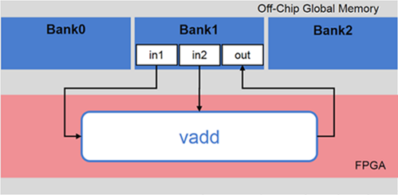

<p align="right">
<a href="../../../docs/mult-ddr-banks/README.md">English</a> | <a>日本語</a>
</p>
<table>
 <tr>
   <td align="center"><h1>2019.1 SDAccel™ 開発環境チュートリアル</h1>
   <a href="https://github.com/Xilinx/SDAccel-Tutorials/branches/all">その他のバージョンを表示</a>
   </td>
 </tr>
 <tr>
 <td align="center"><h1>複数 DDR バンクの使用</h1>
 </td>
 </tr>
</table>

# 概要

SDAccel™ 環境では、カーネルと DDR の間のデータ転送に、デフォルトでは 1 つの DDR バンクが使用されますが、アプリケーションによっては、データの移動がパフォーマンスのボトルネックになることがあります。カーネルがグローバル メモリ (DDR) と FPGA の間で多量のデータを移動する必要がある場合、複数の DDR バンクを使用できます。これにより、カーネルが複数のメモリ バンクに同時にアクセスできるようになり、アプリケーションのパフォーマンスが向上します。

xocc `--sp` オプションを使用してシステム ポート マップ指定すると、カーネル ポートを DDR や PLRAM などの特定のグローバル メモリ バンクにマップできます。このチュートリアルでは、カーネル ポートを複数の DDR バンクにマップする方法を示します。

# チュートリアルの概要

このチュートリアルでは、単純な Vector Addition サンプルを使用します。このサンプルは、`vadd` カーネルが `in1` および `in2` からデータを読み出し、その結果の `out` を生成します。

このチュートリアルでは、3 つの DDR バンクを使用して Vector Addition アプリケーションをインプリメントします。

XOCC コンパイラのデフォルトの動作では、カーネルとグローバル メモリの間のデータ転送に 1 つの DDR バンクが使用され、`in1`、`in2`、および `out` ポートを介するすべてのデータ アクセスがプラットフォームのデフォルト DDR バンクを介して実行されるようになっています。



これを、次のようにアクセスするように変更します。

* `in1` は `Bank0` を介する
* `in2` は `Bank1` を介する
* `out` は `Bank2` を介する


必要なマッピングを達成するには、SDAccel ツールで、各カーネル引数が適切なバンクに接続されるように設定します。

このチュートリアルの例では C++ カーネルを使用しますが、RTL および OpenCL™ API カーネルでも手順は同じです。

# 開始前の注意点

このチュートリアルでは、次を使用します。

* BASH Linux シェル コマンド
* 2019.1 SDx™ リリースおよび xilinx\_u200\_xdma\_201830\_1 プラットフォーム。必要であれば、その他のバージョンおよびプラットフォームも使用できます。

> **重要:**
>
> * サンプル ファイルを実行する前に、『SDAccel 開発環境リリース ノート、インストール、およびライセンス ガイド』 ([UG1238](https://www.xilinx.com/html_docs/xilinx2019_1/sdaccel_doc/yrc1534452173645.html)) で説明されるように、ザイリンクス ランタイム (XRT) と SDAccel 開発環境ツールをインストールしてください。
> * Alveo™ カードでアプリケーションを実行する場合は、『Alveo データセンター アクセラレータ カード入門ガイド ([UG1301](https://www.xilinx.com/support/documentation/boards_and_kits/accelerator-cards/ug1301-getting-started-guide-alveo-accelerator-cards.pdf)) で説明されるように、カードとソフトウェア ドライバーを正しくインストールしてください。

## チュートリアル リファレンス ファイルの入手

1. リファレンス ファイルを入手するには、ターミナルに `git clone https://github.com/Xilinx/SDAccel-Tutorials` と入力します。
2. `SDAccel-Tutorials-master/docs/mult-ddr-banks/reference-files` に移動します。

## チュートリアルの設定

1. SDx 環境、プラットフォームおよびランタイムを設定するには、次のコマンドを実行します。

   ```bash
     #setup Xilinx SDx tools, XILINX_SDX and XILINX_VIVADO will be set in this step. source <SDX install path>/settings64.sh. for example:
     source /opt/Xilinx/SDx/2019.1/settings64.sh
     #Setup runtime. XILINX_XRT will be set in this step
     source /opt/xilinx/xrt/setup.sh
   ```

2. makefile を実行してハードウェア エミュレーション用のデザインをビルドします。

   ```bash
   cd reference-files
   make all
   ```

   > **makefile オプションの説明**
   >
   > * `MODE := hw_emu`: ビルド コンフィギュレーション モードをハードウェア エミュレーションに設定します。
   > * `PLATFORM := xilinx_u200_xdma_201830_1`: ターゲット プラットフォームを選択します。
   > * `KERNEL_SRC := src/vadd.cpp`: カーネル ソース ファイルをリストします。
   > * `HOST_SRC := src/host.cpp`: ホスト ソース ファイルをリストします。

   前述のように、デザインのデフォルト インプリメンテーションでは 1 つの DDR バンクが使用されます。\[Console] ビューにリンク段階で表示されるメッセージを確認します。次のようなメッセージが表示されるはずです。

   ```
   ip_name: vadd
   Creating apsys_0.xml
   INFO: [CFGEN 83-2226] Inferring mapping for argument vadd_1.in1 to DDR[1]
   INFO: [CFGEN 83-2226] Inferring mapping for argument vadd_1.in2 to DDR[1]
   INFO: [CFGEN 83-2226] Inferring mapping for argument vadd_1.out to DDR[1]
   ```

   SDx 環境により、`--sp` が設定されていない各カーネル引数に対してマップが自動的に推論されているのがわかります。

3. makefile に `check` オプションを付けて、ハードウェア エミュレーションを実行します。

   ```bash
   make check
   ```

   シミュレーションが終了したら、次のようにカーネル データ転送のメモリ接続がレポートされます。

   ```
   TEST PASSED
   INFO: [SDx-EM 22] [Wall clock time: 22:51, Emulation time: 0.0569014 ms] Data transfer between kernel(s) and global memory(s)
   vadd_1:m_axi_gmem0-DDR[1]          RD = 0.391 KB               WR = 0.000 KB
   vadd_1:m_axi_gmem1-DDR[1]          RD = 0.391 KB               WR = 0.000 KB
   vadd_1:m_axi_gmem2-DDR[1]          RD = 0.000 KB               WR = 0.391 KB
   ```

では、データ転送を次の 3 つに分割する方法を示します。

* `DDR Bank 0`
* `DDR Bank 1`
* `DDR Bank 2`

## XOCC リンカー オプションの設定

XOCC カーネル リンカーでカーネル引数が対応するバンクに接続されるように設定します。`--sp` オプションを使用して、カーネル ポートまたはカーネル引数をマップします。

* **カーネル引数**:

  ```
  --sp <kernel_cu_name>.<kernel_arg>:<sptag>
  ```

  * `<kernel_cu_name>`: 計算ユニット (CU) 名。カーネル名にアンダースコア (`_`) と値 `1` から開始するインデックス (`index`) を付けたものになります。たとえば、vadd カーネルの計算ユニットの名前は `vadd_1` などになります。
  * `<kernel_arg>`: CU の関数引数。vadd カーネルのカーネル引数は、`vadd.cpp` ファイルに含まれます。
  * `<sptag>`: ターゲット プラットフォームで使用可能なメモリ リソース。有効な sptag 名は DDR、PLRAM などです。このチュートリアルでは、`DDR[0]`、`DDR[1]`、および `DDR[2]` をターゲットにします。`<sptag>[min:max]` のようにすると、範囲を指定できます。

1. vadd カーネルの `--sp` コマンド オプションを定義し、これを makefile に追加します。

   カーネル インスタンス名は `vadd_1` になります。vadd カーネルのカーネル引数は、`vadd.cpp` ファイルで指定します。カーネル引数 (`in1`、`in2`、および `out`) を `DDR[0]`、`DDR[1]`、および `DDR[2]` に接続する必要があるので、  
`--sp` オプションは次のようになります。

   ```
   --sp vadd_1.in1:DDR[0]
   --sp vadd_1.in2:DDR[1]
   --sp vadd_1.out:DDR[2]
   ```

   * 引数 `in1` は DDR Bank0 にアクセス
   * 引数 `in2` は DDR Bank1 にアクセス
   * 引数 `out` は DDR Bank2 にアクセス

   makefile に 3 つの `--sp` オプションを追加して、XOCC リンカーに渡されるようにします。すべての `--sp` オプションをまとめると、次のようになります。

   ```
   --sp vadd_1.in1:DDR[0] --sp vadd_1.in2:DDR[1] --sp vadd_1.out:DDR[2]
   ```

   SDAccel ツールでこれらのオプションを指定する際のミスを避けるには、SDAccel makefile で次の行を見つけて、XOCC\_LINK\_OPTS 行のコメントをはずして、XOCC リンカーに対してこれらのオプションを指定します。

   ```bash
   # Linker options to map kernel ports to DDR banks
   XOCC_LINK_OPTS := --sp vadd_1.in1:DDR[0] --sp vadd_1.in2:DDR[1] --sp vadd_1.out:DDR[2]
   ```

   > **注記:** DDR バンクを割り当てる際は、`--slr` オプションを使用して CU を特定の SLR に割り当てます。CU は、<sptag> 値で指定されたメモリ リソースを含む同じ SLR に割り当てる必要があります。
   >
   > このオプションの構文は `--slr <COMPUTE_UNIT>:<SLR_NUM>` で、COMPUTE\_UNIT は CU の名前、SLR\_NUM は CU を割り当てる SLR 番号です。  
たとえば、`xocc … --slr vadd_1:SLR2` では `vadd_1` という名前の計算ユニットが SLR2 に割り当てられます。

2. 変更を保存したら、\[HW-Emulation] モードでデザインのビルドを終了します。

   ```bash
    make clean
    make all
   ```

   \[Console] ビューにリンク段階で表示されるメッセージを確認します。次のようなメッセージが表示されるはずです。

   ```
   ip_name: vadd
   Creating apsys_0.xml
   INFO: [CFGEN 83-0] Port Specs:
   INFO: [CFGEN 83-0]   kernel: vadd_1, k_port: in1, sptag: DDR[0]
   INFO: [CFGEN 83-0]   kernel: vadd_1, k_port: in2, sptag: DDR[1]
   INFO: [CFGEN 83-0]   kernel: vadd_1, k_port: out, sptag: DDR[2]
   INFO: [CFGEN 83-2228] Creating mapping for argument vadd_1.in1 to DDR[0] for directive vadd_1.in1:DDR[0]
   INFO: [CFGEN 83-2228] Creating mapping for argument vadd_1.in2 to DDR[1] for directive vadd_1.in2:DDR[1]
   INFO: [CFGEN 83-2228] Creating mapping for argument vadd_1.out to DDR[2] for directive vadd_1.out:DDR[2]
   ```

   このメッセージには、SDAccel 環境で、`--sp` オプションの設定に基づいて、カーネル引数が指定の DDR バンクに正しくマップされたことが示されています。

3. ハードウェア エミュレーションを実行して、デザインが正しいかどうか確認します。

   ```bash
   make check
   ```

シミュレーションが終了したら、カーネル データ転送のメモリ接続が次のようにレポートされます。

```
TEST PASSED
INFO: [SDx-EM 22] [Wall clock time: 23:15, Emulation time: 0.054906 ms] Data transfer between kernel(s) and global memory(s)
vadd_1:m_axi_gmem0-DDR[0]          RD = 0.391 KB               WR = 0.000 KB
vadd_1:m_axi_gmem1-DDR[1]          RD = 0.391 KB               WR = 0.000 KB
vadd_1:m_axi_gmem2-DDR[2]          RD = 0.000 KB               WR = 0.391 KB
```

プロファイル サマリ レポート (profile\_summary.html) の「Kernel to Global Memory」セクションの「Memory Resources」からもデータ転送を確認できます。各カーネル引数に割り当てた DDR バンクと、ハードウェア エミュレーション中の各インターフェイスのトラフィックが表示されます。


## まとめ

このチュートリアルでは、カーネル vadd の `in1`、`in2`、および `out` ポートのデフォルトのマップを 1 つの DDR バンクから複数の DDR バンクに変更する方法を示しました。次の方法も学びました。

* `--sp` オプションを使用して XOCC リンカー オプションを設定し、カーネル引数を複数の DDR バンクに接続。
* アプリケーションをビルドして DDR マップを確認。
* ハードウェア エミュレーションを実行し、各ポートの転送レートおよび帯域幅使用率を確認。

</br>
<hr/>
<p align= center><b><a href="../../README.md">メイン ページに戻る</a></b></p>
<p align="center"><sup>Copyright&copy; 2019 Xilinx</sup></p>
